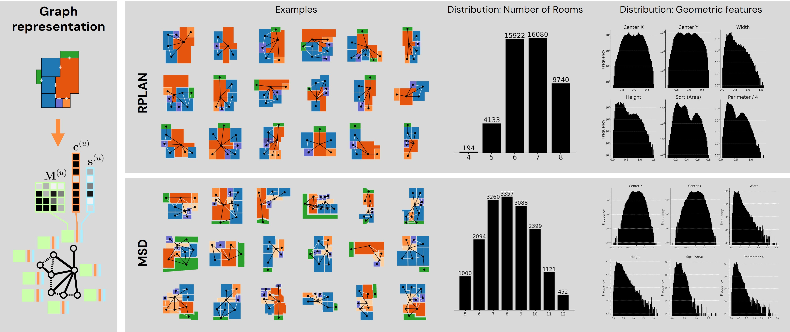
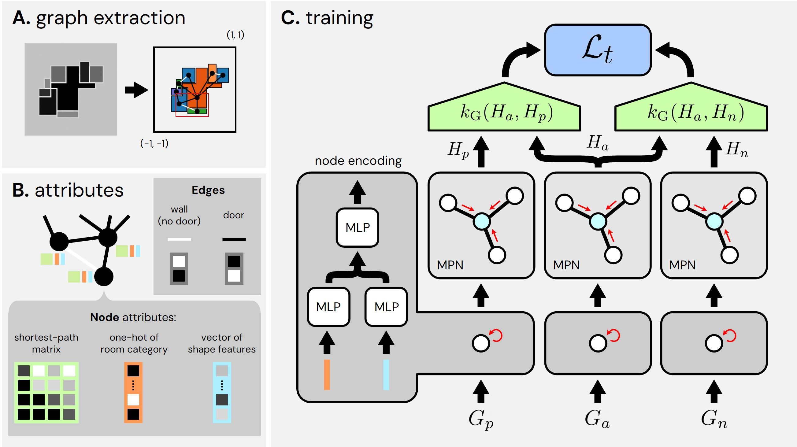

# LayoutGKN: Graph Similarity Learning of Floor Plans

The code accompanies the paper [LayoutGKN: Graph Similarity Learning of Floor Plans](https://arxiv.org/abs/2509.03737), to appear in [BMVC 2025](https://bmvc2025.bmva.org/).
<br />
By 
[Casper van Engelenburg](https://caspervanengelenburg.github.io/) (👋), 
[Jan van Gemert](https://jvgemert.github.io/), 
[Seyran Khademi](https://www.tudelft.nl/en/ewi/over-de-faculteit/afdelingen/intelligent-systems/pattern-recognition-bioinformatics/computer-vision-lab/people/seyran-khademi).


**Abstract** -
Floor plans depict building layouts and are often represented as graphs to capture the underlying spatial relationships. 
Comparison of these graphs is critical for applications like search, clustering, and data visualization. 
The most successful methods to compare graphs i.e., graph matching networks, rely on costly intermediate cross-graph node-level interactions, therefore being slow in inference time. 
We introduce **LayoutGKN**, a more efficient approach that postpones the cross-graph node-level interactions to the end of the joint embedding architecture. 
We do so by using a differentiable graph kernel as a distance function on the final learned node-level embeddings. 
We show that LayoutGKN computes similarity comparably or better than graph matching networks while significantly increasing the speed.

## 🛠

It is a work-in-progress repository.
Few elements are missing still and I think that here and there extra explanations could help a lot in understanding the code and how to use it (eg, by adding notebooks).
The following will be added before the start of the conference in Sheffield:

- [ ] `.py` Script for evaluation
- [ ] `.py` Script for generating the triplets
- [ ] `.ipynb` Notebook on training and evaluation
- [ ] `.ipynb` Notebook on visualizing the data, running models for retrieval, and making cool and informative 2D search maps using tSNE.
- [ ] 🚩 Add properly trained model checkpoints to `models/`
- [ ] 🔍 Add explanation on floor plan graph definition and formats to `README.md`: `networkx` and `pytorch geometric` packages; node-, edge-, and graph-level attributes; graph triplets.

Nonetheless, the repo including publicly available preprocessed data (see section `Data` below) should be enough to train your own models!

## Usage

For installation, first clone the repository
```bash
git clone https://github.com/caspervanengelenburg/LayoutGKN.git
cd LayoutGKN
```

And install it using `uv`:
```bash
uv pip install .
```

And install Pytorch Geometric (PyG) using a correct wheel, for instance PyTorch 2.8 with CUDA 12.8:

```bash
 uv pip install torch-geometric torch-scatter torch-sparse torch-cluster torch-spline-conv pyg-lib \
    --find-links https://data.pyg.org/whl/torch-2.8.0+cu128.html
```

Note that not all "pairings" between PyTorch and PyG exist.
For more details, see the [PyG Docs on Installation](https://pytorch-geometric.readthedocs.io/en/latest/install/installation.html).
Btw, they have great tutorials on graph machine learning and processing.

## Data

This is the kind of data we use:



The preprocessed RPLAN data (ie, the graphs and triplets) can be downloaded from our [public drive folder](https://drive.google.com/drive/u/0/folders/1eS91rwmkw6s74bPcpl_PbgsoOvaQzseQ).
Using this data in your project?
Make sure to always cite the [RPLAN paper](http://staff.ustc.edu.cn/~fuxm/projects/DeepLayout/index.html).

You can also produce the graphs yourself from the original images.
First [download the RPLAN dataset by filling in the survey](https://docs.google.com/forms/d/e/1FAIpQLSfwteilXzURRKDI5QopWCyOGkeb_CFFbRwtQ0SOPhEg0KGSfw/viewform).
If they accept your request, you will receive an email with the download link.
Second, create a subfolder within "data/rplan", for instance "original", to store the images and change the default config ("confg/default.yaml") accordingly, simply by changing the key `path_rplan`.
Third you run the preprocessing script:

```bash
python -m scripts.rplan_to_graph.run --path_rplan=PATH/TO/RPLAN/IMAGES --path_data=PATH/TO/RPLAN/GRAPHS
```

If your folders align with the default config ("conf/default.yaml"), you don't have to specify the paths in the terminal.

## Training

Please have a look at our paper for details on training. 
Here is an overview:



(**A. graph extraction**) 
Semantic images from RPLAN are converted into richly-attributed access graphs. 
The floor plans' geometries (\ie, the rooms represented as polygons) are centered at $(0,0)$ and scaled to fit within the unit square box.
The unit box amounts to 20 x 20 meters in reality (\ie, 0.1 equals 1 meter).
The color indicates the room's semantic category (\eg, dark orange for living room, green for balcony).
Edges are modeled when two rooms share a door (black) or a wall (white edge).
(**B. attributes**) 
Each node represents a room and is endowed with 3 attributes: the shortest-path matrix, a one-hot encoding of the room's category and a vector of shape features.
(**C. training**)
LayoutGKN is trained using triplets of graphs, each containing an anchor ($G_a$), positive ($G_a$), and negative ($G_a$) graph.
The goal is to penalize the relative distance between anchor-positive and anchor-negative.
Anchor, positive, and negative are simultaneously fed into parameter-shared graph neural networks, which consist of a node encoder (dark gray box), followed by a series of $L$ graph message passing network layers (light gray box).
This results in embedded graphs ($H_i$).
The anchor-positive and anchor-negative similarities are computed as $s_{\text{ap}} = k_G (H_a, H_p)$ and $s_{\text{an}} = k_G (H_a, H_n)$, respectively.
Here $k_G (H_i, H_j)$ is the GraphHopper path-based kernel on the node embeddings of $H_i$ and $H_j$.
The triplet loss $\mathcal{L}_t$ penalizes the relative distance $\log(s_{\text{an}} / s_{\text{ap}})$, given a margin $m$.

For running a single training run:
```bash
python -m scripts.run --lr=1e-4 --num_layers=4  # etc. see cfg.yaml
```

By default, weights and biases (W&B) is used for logging.
Don't want to use it, you can simply remove the W&B parts in the "scripts/run.py" script.
I highly encourage to always use W&B.

## Citation

Please cite our work if you use our code and/or method:

<pre><code>
@inproceedings{van_engelenburg_layoutgkn_2025,
      title={LayoutGKN: Graph Similarity Learning of Floor Plans},
      author={van Engelenburg, Casper and van Gemert, Jan and Khademi, Seyran},
      booktitle={BMVC},
      year={2025}
}
</code></pre>
