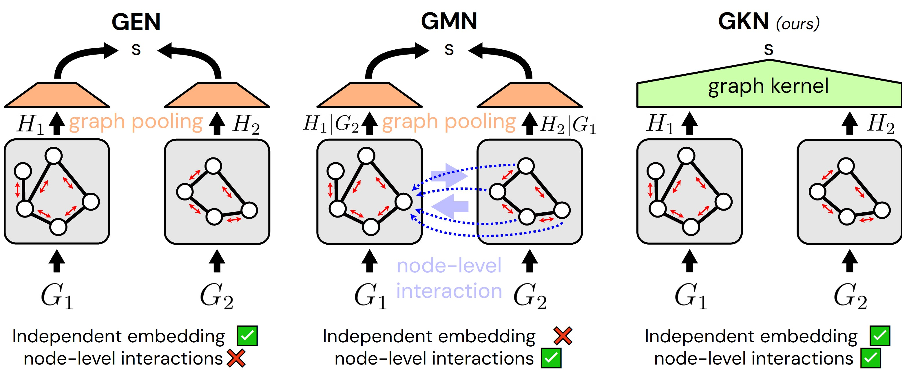

# LayoutGKN: Graph Similarity Learning of Floor Plans

The code accompanies the paper [LayoutGKN: Graph Similarity Learning of Floor Plans](https://arxiv.org/abs/2509.03737), to appear in [BMVC 2025](https://bmvc2025.bmva.org/).
<br />
By 
[Casper van Engelenburg](https://caspervanengelenburg.github.io/) (👋), 
[Jan van Gemert](https://jvgemert.github.io/), 
[Seyran Khademi](https://www.tudelft.nl/en/ewi/over-de-faculteit/afdelingen/intelligent-systems/pattern-recognition-bioinformatics/computer-vision-lab/people/seyran-khademi).



**Abstract** -
Floor plans depict building layouts and are often represented as graphs to capture the underlying spatial relationships. 
Comparison of these graphs is critical for applications like search, clustering, and data visualization. 
The most successful methods to compare graphs i.e., graph matching networks, rely on costly intermediate cross-graph node-level interactions, therefore being slow in inference time. 
We introduce **LayoutGKN**, a more efficient approach that postpones the cross-graph node-level interactions to the end of the joint embedding architecture. 
We do so by using a differentiable graph kernel as a distance function on the final learned node-level embeddings. 
We show that LayoutGKN computes similarity comparably or better than graph matching networks while significantly increasing the speed.

## TODOs

Few elements are missing (1 script and checkpoints), and I think that here and there extra explanations could help a lot in understanding the code and how to use it (eg, by adding notebooks).
The following things will be finished before the conference in Sheffield:

- [ ] Script for generating the triplets
- [ ] Add model checkpoints (in `models/`)
- [ ] Add explanation (in `README.md`) on graph formats (networkx, pytorch geometric, node features, edge features, triplets of graphs)
- [ ] Extra notebooks to provide more information on: training, evaluation, and visualization

Nonetheless, the repo including publicly available preprocessed data should be enough to train your own models!

## Usage

For installation, first clone the repository
```bash
git clone https://github.com/caspervanengelenburg/LayoutGKN.git
cd LayoutGKN
```

And install it using `uv`:
```bash
uv pip install ".[torch-core,pyg-core]" \
  --index-url https://pypi.org/simple \
  --extra-index-url https://download.pytorch.org/whl/cu128 \
  -f https://data.pyg.org/whl/torch-2.8.0+cu128.html
```

Or CPU variant:
```bash
uv pip install ".[torch-core,pyg-core]" \
  --index-url https://pypi.org/simple \
  -f https://data.pyg.org/whl/torch-2.8.0+cpu.html
```

If these lines for some reason do not work, please have a look at the dependencies in `pyproject.toml`.

## Data

The preprocessed RPLAN data (*i.e.*, the graphs and triplets) can be downloaded from our [public drive folder](https://drive.google.com/drive/u/0/folders/1eS91rwmkw6s74bPcpl_PbgsoOvaQzseQ).
Using this data in your project?
Make sure to *always* cite the [RPLAN paper](http://staff.ustc.edu.cn/~fuxm/projects/DeepLayout/index.html).

You can also produce the graphs yourself from the original images.
First [download the RPLAN dataset by filling in the survey](https://docs.google.com/forms/d/e/1FAIpQLSfwteilXzURRKDI5QopWCyOGkeb_CFFbRwtQ0SOPhEg0KGSfw/viewform).
If they accept your request, you will receive an email with the download link.
Second, create a subfolder within `data/rplan`, for instance `original`, to store the images and change the default config (`confg/default.yaml`) accordingly, simply by changing the key `path_rplan`.
Third you run the preprocessing script:

```bash
python -m scripts.rplan_to_graph.run
```

## Training and evaluation

For running a single training run + (optionally) log to W&B:
```bash
python -m scripts.run --lr=1e-4 --num_layers=4  # etc. see cfg.yaml
```

## Citation

Please cite our work if you use our code and/or method:

<pre><code>
@inproceedings{van_engelenburg_layoutgkn_2025,
      title={LayoutGKN: Graph Similarity Learning of Floor Plans},
      author={van Engelenburg, Casper and van Gemert, Jan and Khademi, Seyran},
      booktitle={BMVC},
      year={2025}
}
</code></pre>
